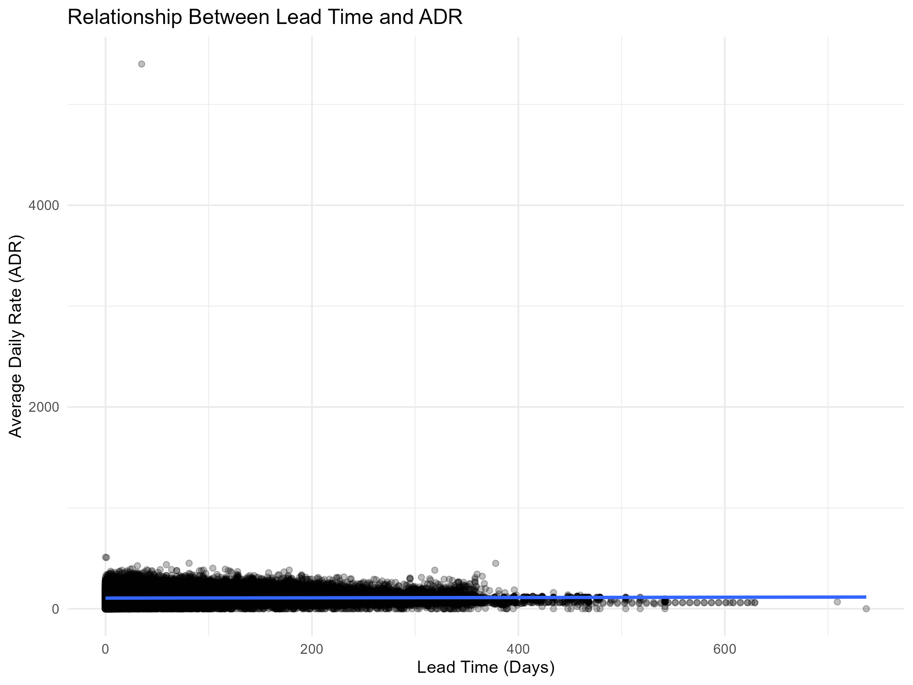
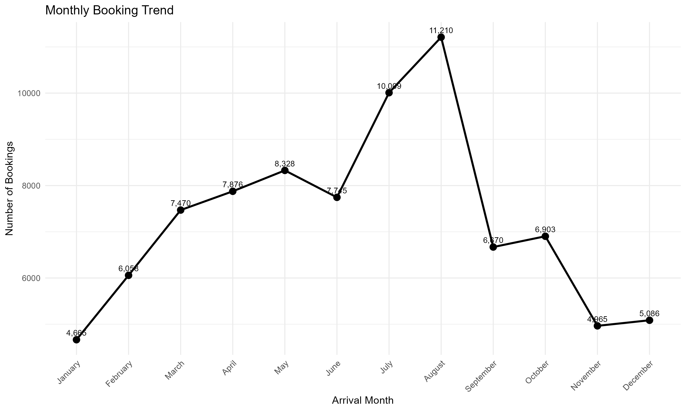
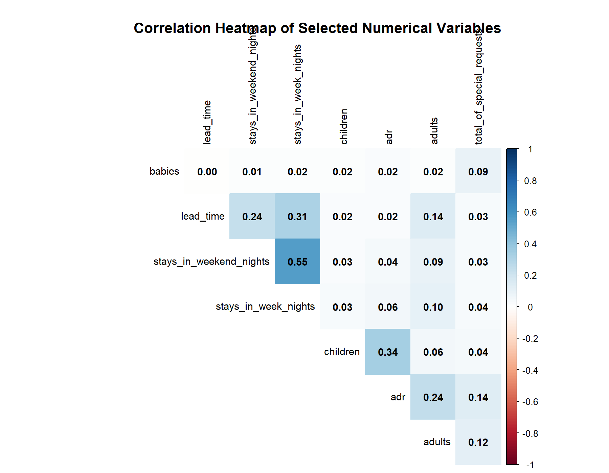
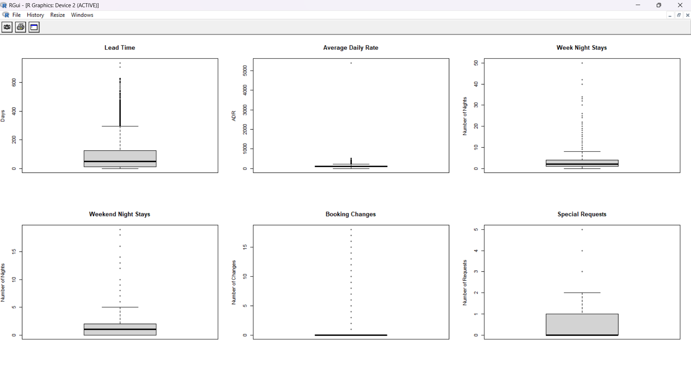

# Week 1 – Data Cleaning and Preliminary Analysis with R

## Project Overview

This project is part of my Week 1 internship task focused on Data Cleaning and Preliminary Analysis using R.

The Hotel Booking Demand dataset was analyzed to identify and handle data-quality issues and perform preliminary exploratory analysis.

## Objectives

- Load and inspect the dataset
- Analyze missing values
- Detect and remove duplicate records
- Handle missing values
- Identify invalid values
- Detect potential outliers using the IQR method
- Apply Min-Max normalization
- Encode categorical variables
- Calculate descriptive statistics
- Perform correlation analysis
- Create exploratory visualizations
- Generate initial insights
- Export the cleaned dataset

## Dataset

**Hotel Booking Demand**

The dataset contains hotel reservation information including:

- Hotel type
- Booking cancellation status
- Lead time
- Arrival information
- Number of guests
- Length of stay
- Market segment
- Room type
- Deposit type
- Customer type
- Average Daily Rate (ADR)
- Reservation status

## Tools and Technologies

- R
- RGui
- Base R
- corrplot

## Project Structure

```text
Hotel-Booking-Data-Cleaning-R/
│
├── R/
│   └── Week_1_Data_Cleaning_Preliminary_Analysis.R
│
├── Data/
│   └── processed/
│       └── hotel_bookings_clean.csv
│
├── Outputs/
│   ├── correlation_heatmap.png
│   ├── outlier_boxplots.png
│   └── exploratory_visualizations.png
│
└── Report/
    └── Week_1_Data_Cleaning_Preliminary_Analysis_Report.docx
---

# Task 2 – Data Visualization with R

## Project Overview

This project is part of my Week 2 internship task focused on **Data Visualization using R**.

The **Hotel Booking Demand dataset** was analyzed and visualized to identify booking patterns, cancellation behavior, hotel-type differences, customer distribution, and relationships between important numerical variables.

The objective of this task was to transform cleaned hotel booking data into meaningful and easy-to-understand visualizations using R.

---

## Objectives

- Create meaningful visualizations using R
- Analyze booking cancellation patterns
- Compare City Hotel and Resort Hotel
- Analyze booking trends by month and year
- Visualize booking lead-time distribution
- Analyze Average Daily Rate (ADR)
- Examine the relationship between lead time and ADR
- Analyze bookings across different market segments
- Identify important patterns and trends from the visualizations
- Present findings using clear and professional charts

---

## Dataset

**Dataset:** Hotel Booking Demand

The dataset contains hotel booking records with information related to:

- Hotel type
- Booking status
- Arrival date
- Lead time
- Average Daily Rate (ADR)
- Market segment
- Length of stay
- Customer information
- Cancellation status
- Other booking-related attributes

The visualizations were created using the cleaned dataset prepared during **Task 1 – Data Cleaning and Preliminary Analysis**.

---

## Tools and Technologies

- **R**
- **RStudio / R Environment**
- **ggplot2**
- **dplyr**
- **tidyr**
- **readr**
- **Base R visualization functions**

---

## Visualizations Created

### 1. Average Daily Rate by Hotel Type

This boxplot compares the distribution of Average Daily Rate (ADR) between City Hotel and Resort Hotel.


---

### 2. Distribution of Average Daily Rate

This histogram shows the distribution of ADR values across hotel bookings.


---

### 3. Booking Cancellation Status

This bar chart shows the number of canceled and non-canceled bookings.


---

### 4. Cancellation Rate by Hotel Type

This visualization compares cancellation rates between City Hotel and Resort Hotel.


---

### 5. Hotel Type Distribution

This chart presents the number of bookings for City Hotel and Resort Hotel.


---

### 6. Distribution of Booking Lead Time

This histogram shows how far in advance guests made their hotel bookings.


---

### 7. Relationship Between Lead Time and ADR

This scatter plot examines the relationship between booking lead time and Average Daily Rate.



---

### 8. Bookings by Market Segment

This horizontal bar chart shows the number of bookings across different market segments.


---

### 9. Monthly Booking Trend

This line chart shows the number of bookings across the different arrival months.



---

### 10. Year-wise Booking Trend

This visualization shows the number of bookings recorded across the available arrival years.


---

### 11. Correlation Heatmap

The correlation heatmap visualizes relationships between selected numerical variables in the dataset.



---

### 12. Outlier Boxplots

Boxplots were used to visually examine potential outliers in selected numerical variables such as lead time, ADR, stay duration, booking changes, and special requests.



---

## Key Observations

The visualizations provided several useful observations from the hotel booking data:

- The dataset contains both **City Hotel** and **Resort Hotel** bookings, with City Hotel representing a larger share of the analyzed bookings.
- The overall booking data contains both **canceled and non-canceled reservations**, with non-canceled bookings forming the larger group.
- The cancellation rate differs between City Hotel and Resort Hotel.
- Booking activity varies considerably across arrival months, showing noticeable seasonal patterns.
- The yearly booking trend shows differences in booking volume across the available years.
- The lead-time distribution is right-skewed, with many bookings made relatively close to the arrival date and fewer bookings having very long lead times.
- ADR is also highly right-skewed, with most observations concentrated at lower values and a smaller number of unusually high values.
- Online Travel Agencies account for a large proportion of the observed market-segment bookings.
- The scatter plot indicates that the relationship between lead time and ADR is relatively weak, although the data contains substantial variation and some extreme observations.
- The correlation heatmap helps identify the strength and direction of relationships among selected numerical variables.

---

## Visualization Techniques Used

The project uses different visualization techniques according to the analytical purpose:

| Visualization | Purpose |
|---|---|
| Bar Chart | Compare categorical booking counts |
| Histogram | Analyze numerical distributions |
| Boxplot | Compare distributions and identify potential outliers |
| Scatter Plot | Examine relationships between numerical variables |
| Line Chart | Analyze trends over time |
| Correlation Heatmap | Examine relationships among numerical variables |

---

## Project Workflow

The Week 2 visualization process followed these steps:

```text
Cleaned Dataset
      ↓
Load Data into R
      ↓
Data Preparation
      ↓
Select Relevant Variables
      ↓
Create Visualizations
      ↓
Analyze Patterns and Trends
      ↓
Interpret Results
      ↓
Export Visualization Images
      ↓
Document Findings
